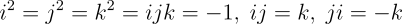

# Rotations
## Overview

3D rotations performed with 4 different methods axis-angle methods:
- quaternions
- Rodrigues matrix formula
- Rodrigues vector formula
- Pauli matrices

A benchmark test with 1,000,000 random vectors resulted in the following times:

| Method       | total time (s) | relative time | 
| ---          | ---            |  ---          |
| Quaternion   | 0.9749         |  1.000        |
| Rodrigues - vector | 1.1342   |  1.163        |
| Rodrigues - matrix | 2.2802   |  2.339        |
| Pauli              | 2.9049   |  2.980        |

Processor: Intel(R) Core(TM) i7-8550U CPU 2.00 GHz

## Methods
### Quaternions

A quaternion is a four dimensional number defined by:

where

Each of the basis units corresponds to a 90&deg; rotation about a corresponding axis (x, y, z).

A unit quaternion is constructed using the axis-angle parameters &theta; and n:

From this the rotation is accomplished with the following formula:

Where q* is the conjugate defined as a quaternion with negative basis units.
The combined effect of the post-multiplication and conjugate removes 4th dimensional remnants, resulting in a 3D dimensional vector (s=0).

### Rodrigues formula

Rodrigues' rotation formulas can be motivated with a 3D dimensional drawing, unlike the quaternion rotation formula.

In vector form, it is given by:

This can be readily converted to a matrix formula:

Multiple vectors can then be stacked into a matrix and rotated simultaneously utilising linear algebra optimisations:

### Pauli matrices

From quantum mechanics, a 2&times;2 Pauli matrix is defined as:

Then the 2&times;2 Unitary (rotation) matrix is calculated:

The rotated Pauli form is then given by:

The &dagger; symbol is for the complex conjugate of U.
This rotation formula is similar to the quaternion rotation formula, which also uses a pre- and post-multiplication and a complex conjugate.

The Pauli formula does redundant calculations by calculating every co-ordinate twice. Hence it will be the slowest formula. 